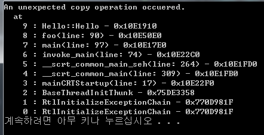

copy_finder
====

__copy_finder__ can help you to find unexpected copy operation on your C++ code. If an unexpected copy occurred, it will print the callstack before entering the copy constructor.

Usage
----

Options
----
You can specify behavior when `copy_checker` detects unallowed copy operation.
* `CC_BREAK`
  * triggers a breakpoint and the program will be stopped immediately.
* `CC_LOG`
  * prints callstack log to `stdout` and the program will keep running. 
* `CC_PROFILE`
  * prints all copy points at program ends.
* `CC_IGNORE`
  * does nothing.

Example
----
```c++
class Hello : copy_checker {
};

Hello foo() {
	Hello dd;

	return dd;
}
Hello foo(Hello &f) {
	return f;
}

int main() {
	Hello a = foo(); // passsssssss

	Hello b = foo(a); // omg

  return 0;
}
```


Remarks
----
* This program requires Visual Studio 2015 or higher. (Windows only)

License
----
```
            DO WHAT THE FUCK YOU WANT TO PUBLIC LICENSE
                    Version 2, December 2004

 Copyright (C) 2004 Sam Hocevar <sam@hocevar.net>

 Everyone is permitted to copy and distribute verbatim or modified
 copies of this license document, and changing it is allowed as long
 as the name is changed.

            DO WHAT THE FUCK YOU WANT TO PUBLIC LICENSE
   TERMS AND CONDITIONS FOR COPYING, DISTRIBUTION AND MODIFICATION

  0. You just DO WHAT THE FUCK YOU WANT TO.
```
